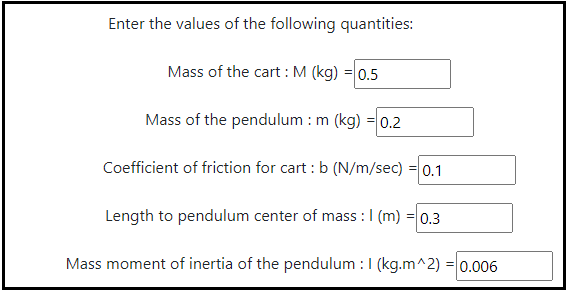
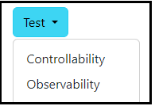

### Procedure

<b>Steps to perform the simulation</b>

										
1. At first enter the values of the Inverted Pendulum on cart quantities.

<b>Fig. 1. Entry of quantity values for inverted pendulum on cart</b>						  

2. Click on 'State Space Model' button to get the state space form of the system.

  

<b>Fig. 2. Button to get the state Space form of the system</b>							  

3. Clicking on 'Test' dropdown-menu for type of test.  

<b>Fig. 3. Dropown menu for selecting type of test</b>							  

4. Click on the desired option to get the required type of test. 

<b>Fig. 4. Desired option to get the type test </b>						  

5. Results will be displayed for the selcted type of test. 

6. Click on 'Clear' button for new values of quantities.

