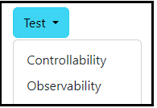
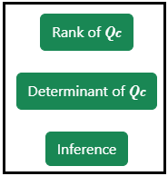
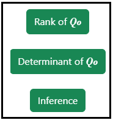

### Procedure

<b>Steps to perform the simulation</b>

<ol type="1">

<li> Enter the values of the Inverted Pendulum on cart quantities. Note: Default values are already given.</li> 

  
<b>Fig. 1. Entry of quantity values for inverted pendulum on cart</b> 						  

 

<li> Click on 'State Space Model' button to get the state space form of the system.</li> 

            

 

  
<b>Fig. 2. Button to get the state Space form of the system</b> 							  

 

<li> Clicking on 'Test' dropdown-menu for type of test.  </li> 

  
<b>Fig. 3. Dropown menu for selecting type of test</b> 							  

 

<li> Click on the desired option to get the required type of test. </li> 

  
<b>Fig. 4. Desired option to get the type test </b> 						  

 

<li> Click on the 'Run' button to run the selected test. </li> 

  
<b>Fig. 5. Run button to get the results of selected test </b> 						  

 

<li> Click on the 'Rank' or 'Determinant'  or "Inference' buttons to get the the Controllability test. </li> 

  
<b>Fig. 6. Rank, Determinant and Inference of the Controllability test </b> 						  

  

<li> Click on the 'Rank' or 'Determinant'  or "Inference' buttons to get the the Observability test. </li> 

  
<b>Fig. 7. Rank, Determinant and Inference of the Observability test </b> 						  

 

<li> Click on 'Clear' button to enter the new values of quantities.</li>  

</ol>

