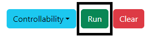

### Procedure

<b>Steps to perform the simulation</b>

										
1. Enter the values of the Inverted Pendulum on cart quantities. Note: Default values are already given.

<b>Fig. 1. Entry of quantity values for inverted pendulum on cart</b>						  

2. Click on 'State Space Model' button to get the state space form of the system.

           

 

<b>Fig. 2. Button to get the state Space form of the system</b>							  

3. Clicking on 'Test' dropdown-menu for type of test.  

<b>Fig. 3. Dropown menu for selecting type of test</b>						  

4. Click on the desired option to get the required type of test. 

<b>Fig. 4. Desired option to get the type test </b>						  

5. Click on the 'Run' button to run the selected test. 

<b>Fig. 5. Run button to get the results of selected test </b>						  

6. Click on the 'Rank' or 'Determinant'  or "inference' buttons to get the the Controllability test. 

<b>Fig. 6. Rank, determinant and inference of the Controllability test </b>						  

 

7. Click on the 'Rank' or 'Determinant'  or "inference' buttons to get the the Observability test. 

<b>Fig. 7. Rank, determinant and inference of the Observability test </b>						  

8. Click on 'Clear' button to enter the new values of quantities.

