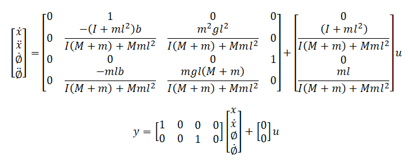

# Theory

Linear time invariant system may be represented in state space form by the following equations:
State equation:
$$ \dot{x}(t)=A x(t)+B u(t) \tag{1a} $$
Output equation:
$$ y(t)= C x(t) + D u(t) \tag{1b} $$
<b><i>Controllability:</i></b>  
The system described by equation (1a) is said to be state controllable at time t = t0 if it is possible to construct 
an unconstrained control signal that will transfer an initial state x(t0)
to any final state x(tf) in a finite time interval 
t0 &le; t &le; tf. If every state is controllable, then the system is said to be completely state controllable.   

Controllability Test: 
The system given by equation (1a) is completely state controllable if and only if the vectors B, AB, A2B,...,An-1B are linearly independent or the (n x n) matrix 
$$ Q_c = [B,AB,A^2B,...A^{n-1}B]$$
is of rank n. Qc is commonly called the controllability matrix.
 

<b><i>Observability:</i></b>  
A system is said to be completely observable if every state x(t0) can be determined from the observation of the output y(t)
over a finite time interval t0 &le; t &le; tf.
The system is, therefore, completely observable if every transistion of the state eventually affects every element of the output vector.   
Observability Test: 
The system is completely observable if and only if the matrix 
$$ Q_o = [C, CA, CA^2,...,CA^{n-1}]^T$$
is of rank n or has n linearly independent column vectors. Qo is commonly called the Observability matrix.  

<b><i>State Space Model of Inverted Pendulumn on cart:</i></b>  
The system consists of an inverted pendulum mounted to a motorized cart. Its popularity derives in part from the fact that it is unstable without control, that is, the pendulum will simply fall over if the cart isn't moved to balance it. 
Additionally, the dynamics of the system are nonlinear. The objective of the control system is to balance the inverted pendulum by applying a force to the cart that the pendulum is attached. A real-world example that relates directly to this inverted pendulum system is the attitude control of a booster rocket at takeoff. 
In this case we will consider a two-dimensional problem where the pendulum is constrained to move in the vertical plane shown in the figure below. For this system, the control input is the force F that moves the cart horizontally and the outputs are the angular position of the pendulum &theta; and the horizontal position of the cart x.  

         
<figcaption style="color:black"> Fig.1. Invereted Pendulum on Cart</figcaption>						  

 
where, M is mass of the cart (kg), m is mass of the pendulum (kg), 
b is coefficient of friction for cart (N/m/sec), l is length to pendulum center of mass (meters), I is mass moment of inertia of the pendulum (kg.m2)
F is force applied to the cart, x is cart position coordinate, &theta; is pendulum angle from vertical (down).  
The linearized equations of motion can also be represented in state-space form: 
Let &Phi; represent the deviation of the pedulum's position, u has been substituted for the input F.

         

 

				                   

